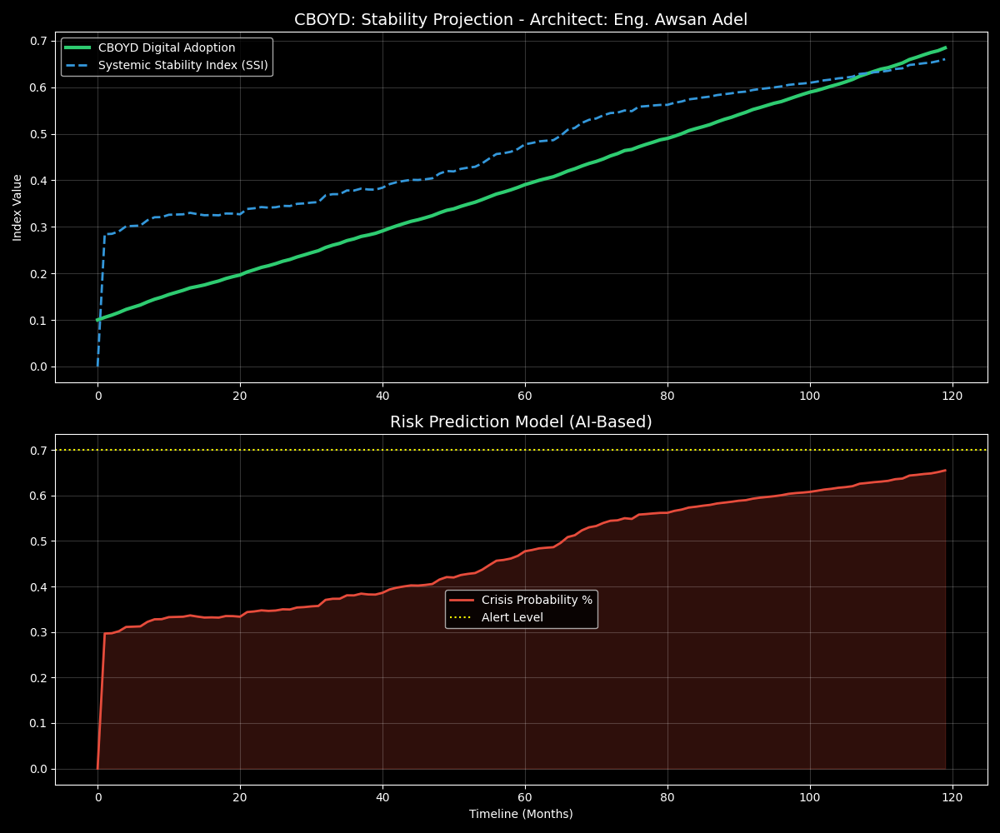

# Central Bank of Yemen Digital (CBOYD) | البنك المركزي اليمني الرقمي

## ⚖️ Intellectual Property & Copyright Notice | إشعار الملكية الفكرية وحقوق النشر
**This project, its conceptual framework, and its architectural code are the exclusive intellectual property of:**
**هذا المشروع وإطاره المفاهيمي وأكواده البرمجية هي ملكية فكرية حصرية لـ:**

*   **Lead Architect:** Eng. Awsan Adel Abdulbari Ahmed Sultan
*   **المهندس المسؤول:** أوسان عادل عبدالباري أحمد سلطان
*   **Country:** Yemen | الجمهورية اليمنية
*   **National ID:** 01010305468
*   **Phone:** [+967 777 852 433](tel:+967777852433)
*   **LinkedIn:** [Profile Link](https://www.linkedin.com/in/awsan-adel-abdulbari-ahmed-sultan-8aa5a1a9)
*   **Registration Date:** May 05, 2026 | تاريخ التسجيل: 05 مايو 2026

> **Legal Declaration:** All rights reserved © 2026. Any unauthorized use, reproduction, or international representation of this framework without explicit written consent from Eng. Awsan Adel is strictly prohibited and subject to international intellectual property laws.

---

## 🌐 Overview | نظرة عامة
**CBOYD** is a strategic national initiative designed to modernize the financial infrastructure of Yemen. It aims to create a unified digital ecosystem that integrates all existing electronic wallets and financial service providers under a single, secure, and regulated framework.

**البنك المركزي اليمني الرقمي (CBOYD)** هو مبادرة وطنية استراتيجية تهدف إلى تحديث البنية التحتية المالية في اليمن، من خلال إنشاء منظومة رقمية موحدة تجمع كافة المحافظ الإلكترونية (جيب، كاش، ون كاش، جوالي، فلوسك، موبايل موني، ام فلوس، عدن كاش، شلن، وغيرها) ومزودي الخدمات المالية تحت إطار تنظيمي وأمني واحد مربوط مباشرة بالبنك المركزي.

## 🚀 Key Objectives | الأهداف الرئيسية
*   **Interoperability:** Seamless fund transfers between different wallets (Jaib, Cash, Onecash, Floosak, Shilling, Aden Cash, Mahfathati, Amfloos (Kurimi), Jawaly, Mobile Money etc.).
*   **Global Integration:** Direct linkage with the **IMF** and **World Bank** using **ISO 20022** standards.
*   **Financial Inclusion:** Reaching unbanked citizens through mobile-first digital solutions.
*   **Anti-Money Laundering (AML):** Implementing automated AI-driven compliance and e-KYC.

## 🛠 Technical Pillars | الركائز التقنية
1.  **Unified API Gateway:** High-speed infrastructure for real-time settlement between local PSPs.
2.  **Blockchain Ledger:** Ensuring transparency and immutability of sovereign financial data.
3.  **Cross-Border Bridge:** Enabling secure international remittances and international bank connectivity.

## 🗺 Roadmap | خارطة الطريق
- [x] **Phase 1 (May 05, 2026):** Core Architecture & Intellectual Property Registration.
- [ ] **Phase 2:** API Specification & Integration with Local Electronic Wallets.
- [ ] **Phase 3:** Pilot Testing for the Digital Riyal (CBDC) Infrastructure.
- [ ] **Phase 4:** Global Connectivity with International Financial Systems (IMF/WB).

---
## 💻 Core System Architecture (Initial Code)
```javascript
/**
 * AUTHOR: Eng. Awsan Adel Abdulbari Ahmed Sultan
 * ID: 01010305468 | YEMEN
 * PROJECT: CBOYD CORE ENGINE
 * DATE: 05.05.2026
 */
const CBOYD = {
    founder: "Eng. Awsan Adel",
    established: "05-05-2026",
    status: "Active / Secure",
    connectInternational: () => {
        console.log("Linking to IMF & World Bank via ISO 20022...");
    }
};
```


---
🔗 **Explore the Architect's Journey:** [View Full Curriculum Vitae (CV)](./CV%20CURRICULUM_VITAE.md)


---
---
### 📊 System Stability & Risk Preview


### 📊 CBOYD Analytics & Risk Prediction
> Our framework includes a **Python-based predictive engine** that simulates digital currency adoption impacts on Yemen's economic stability, ensuring **data-driven decision-making**.

يتضمن إطارنا العملي محركاً تنبؤياً قائماً على لغة بايثون يحاكي آثار تبني العملة الرقمية على الاستقرار الاقتصادي في اليمن، مما يضمن اتخاذ قرارات مبنية على البيانات.


## 📊 CBOYD Live Analytics & Risk Modeling | النمذجة التحليلية الحية (2026)

### ⚖️ Intellectual Property Notice | إشعار الملكية البرمجية 2026
**Author & Lead Architect:** Eng. Awsan Adel Abdulbari Ahmed Sultan
**National ID:** 01010305468 | **YEMEN**
**Copyright © 2026. All Rights Reserved.**

[](https://colab.research.google.com/drive/1a4lWLr5DbcKqLgsA0QRaB4guBSpklEEc?usp=sharing)

> **💡 Note (2026):** For visual charts and static reports, see `CBOYD_Analytics_Report.png`.
---

